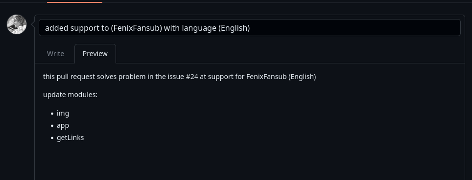
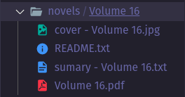

# Welcome

I really enjoy contributing open-source so I'm glad you want to help with the project

There are some rules here for your issue/pull request to be accepted so **let's go**

# Issue

The issue have to be in this format, put a title that has to do with the issue and that briefly describes the problem/suggestion describing your problem, the operating system and your library versions and what you have already tried to do

# pull request

make a title that briefly describes what you did and inform the issue if it solves it or has something to do with it, if it supports a fansub, describe
the name and your language also describe which modules were changed and if possible what changed in each one

# content

This is what has to be generated for the user:

- a README.txt file with the name of the Fansub, your logo if have and the link of your site/page in web

- a summary.txt file with the sequence of read named: summary - {titleVolume}

- a image of cover of volume

- a subfolder named: ilustrations, with all ilustrations of the novel

## pdf file

if a user content a **pdf file** the following items have to be generated in the folder of volume:

- pdf file with all the content of the current volume named: {titleVolume}.pdf
  

## txt file

if a user content a **txt file** the following items have to be generated in the folder of volume:

- a txt file with all the content of the current volume named: {titleVolume}.txt
  
