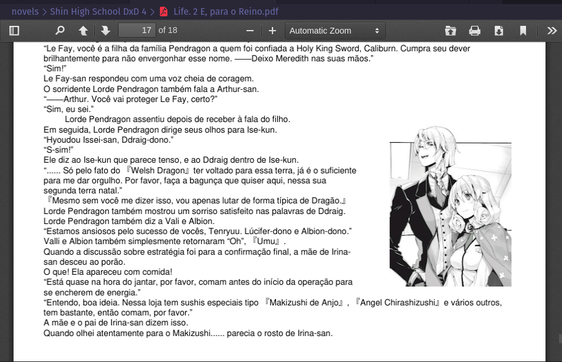
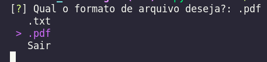
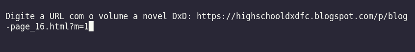
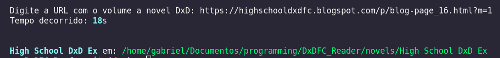
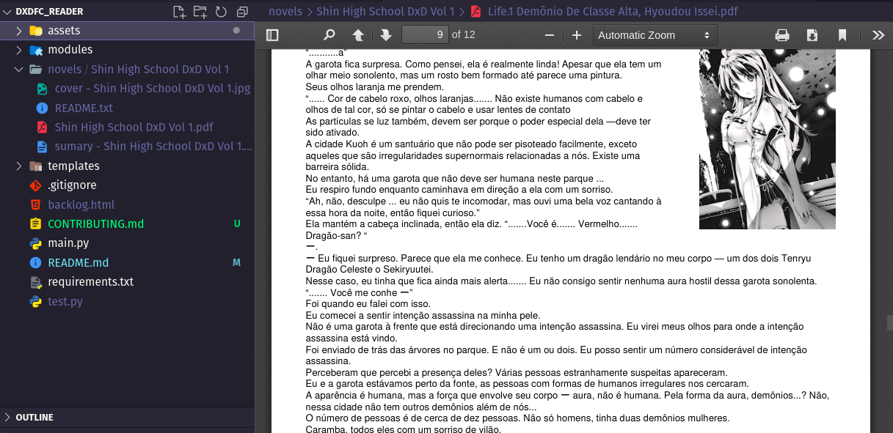

# What is DxDFC Reader?



This is a script written in Python to generate light novel reading files made by fansubs of light novel [High School DxD](https://pt.wikipedia.org/wiki/High_School_DxD)

The project was created as a pure hobby and also because I'm studying [data engineering](https://en.wikipedia.org/wiki/Data_engineering), I'm a big fan of the work so that was my main motivation

I intend to increase the number of fansubs in the project and also add other languages

# Dependencies

for install all librarys just run this code using *pip*:

```pip install -r requirements.txt```

you also will be need of [wkhtmltopdf](https://wkhtmltopdf.org/)

# using 

you can choose the format of archive by menu, txt is more fast but no have images



give the url of a volume of novel



the program go give you the path of novel and the time taken in seconds



will be generated a folder with the novel in the format chosen



# Contributing

if you want to contribute to the project, please read this [Contribution Guide](CONTRIBUTING.md)
